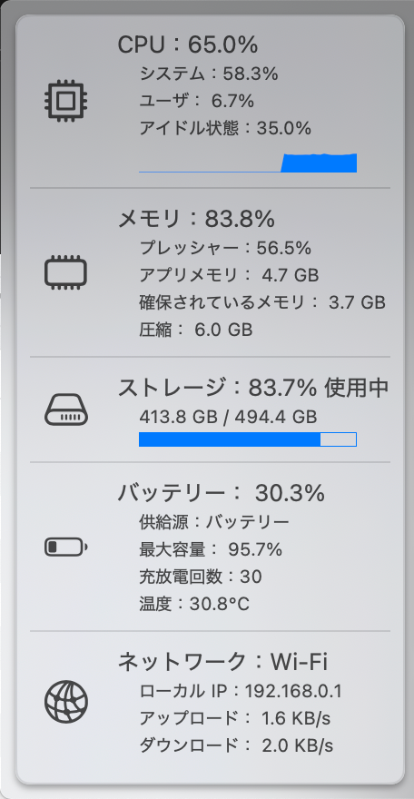

# MacSysMonitor

macOS メニューバー常駐型の軽量システムモニターです。CPU、メモリ、ネットワーク、ストレージ、バッテリーの状態をリアルタイムで監視し、メニューバーにコンパクトに表示します。



## 機能

- **CPU 監視**: システム、ユーザー、アイドル状態を詳細表示
- **メモリ監視**: 使用率、アプリメモリ、確保メモリ、圧縮メモリ、プレッシャー
- **ネットワーク監視**: アップロード/ダウンロード速度、ローカルIP表示
- **ストレージ監視**: 使用量と空き容量
- **バッテリー監視**: 充電レベル、最大容量、サイクル回数、温度
- **表示切替**: メニューバーアイコンでCPU/メモリ/ネットワークを切り替え可能
- **更新間隔調整**: 0.5〜10秒で設定可能（デフォルト1秒）
- **軽量設計**: CPU負荷 <3%、メモリ使用量 <30MB

## 必要環境

- macOS 14.0 以降（Sonoma推奨）
- Xcode 15+ / Swift 5.9+

## プロジェクト構成

```
MacSysMonitor/
├── MacSysMonitor.xcodeproj/      # Xcodeプロジェクト
├── Package.swift                  # Swift Package Manager設定
├── Sources/MacSysMonitor/         # ソースコード
│   ├── MacSysMonitorApp.swift    # エントリポイント、MenuBarExtraセットアップ
│   ├── SystemMonitor.swift       # メトリクス収集エンジン（CPU/メモリ/ネットワーク/ストレージ/バッテリー）
│   ├── MonitorSettings.swift     # 設定の永続化（UserDefaults）
│   ├── GraphView.swift           # Canvas折れ線グラフレンダラー
│   └── MenuBarViews.swift        # メニューバーアイコン＋詳細ポップアップUI
├── Tests/MacSysMonitorTests/     # ユニットテスト
├── MacSysMonitor/                # リソース
│   ├── Info.plist               # LSUIElement=1でDock非表示
│   └── AppIcon.icns             # 角丸アプリアイコン
└── scripts/                      # ビルド自動化
    ├── run_local.sh             # クイックビルド＋インストール＋起動
    ├── make_dmg.sh              # DMGパッケージ作成
    └── generate_rounded_icon.swift  # アイコン生成スクリプト
```

## ビルド & 実行手順

### 方法1: スクリプトを使用（推奨）

```bash
# クイックビルド & インストール & 起動
./scripts/run_local.sh

# DMGパッケージ作成（配布用）
./scripts/make_dmg.sh
# 出力先: dist/MacSysMonitor.dmg
```

### 方法2: Xcodeから実行

1. `open MacSysMonitor.xcodeproj` でXcodeを起動
2. Signing & Capabilitiesでチームを設定（自動署名）
3. ⌘R で実行 → メニューバーに常駐
4. Dockアイコンは表示されません（`LSUIElement=1`）

## 使い方

### メニューバー表示
- アイコンをクリックして表示メトリクスを切り替え：
  - **CPU**: 使用率パーセンテージ
  - **メモリ**: 使用率パーセンテージ
  - **ネットワーク**: 送受信合計速度（Mbps）

### 詳細メニュー
- アイコンをクリックして詳細を表示：
  - 各メトリクスの現在値と内訳
  - プログレスバーで視覚化
  - 更新間隔の調整（0.5〜10秒）
- メトリクスセクションをクリックして、メニューバー表示を切り替え可能

### 設定
- 更新間隔は `UserDefaults` に保存され、次回起動時も保持されます
- 表示メトリクスの選択も永続化されます

## テスト実行

```bash
# すべてのテストを実行
swift test

# 詳細出力付き
swift test --verbose

# 特定のテストのみ
swift test --filter SystemMonitorTests
```

## アーキテクチャ

### データ収集

**SystemMonitor.swift** - 0.5〜10秒ごとにシステムメトリクスを収集：

- **CPU**: `host_statistics` でCPU ticks差分から使用率を算出
- **メモリ**: `host_statistics64` で `internal_page_count`（anonymous pages）をアプリメモリとして取得
- **ネットワーク**: `getifaddrs` + `if_data` でバイトカウンタ差分からMbpsを計算（lo0除外）
- **ストレージ**: `volumeAvailableCapacityForImportantUsage` で正確な使用量を取得
- **バッテリー**: IOKit（`AppleSmartBattery`）から `AppleRawMaxCapacity`、温度（0.1K単位→摂氏変換）を取得

### データフロー

1. `SystemMonitor.refresh()` → システムAPIからメトリクス収集
2. `MetricsSample` を120サンプルのローリングバッファに追加
3. SwiftUIビュー（`MenuBarIconView`、`DetailMenuView`）が `@Published` 経由で更新を監視
4. `GraphView` がCanvasで折れ線グラフを描画

## 自動起動 (LaunchAgent) 例
`~/Library/LaunchAgents/com.example.macsysmonitor.plist` を作成し、以下を保存してください（パスは自身のビルド結果に合わせて調整）。

```xml
<?xml version="1.0" encoding="UTF-8"?>
<!DOCTYPE plist PUBLIC "-//Apple Computer//DTD PLIST 1.0//EN" "http://www.apple.com/DTDs/PropertyList-1.0.dtd">
<plist version="1.0">
<dict>
  <key>Label</key>
  <string>com.example.macsysmonitor</string>
  <key>ProgramArguments</key>
  <array>
    <string>/Applications/MacSysMonitor.app/Contents/MacOS/MacSysMonitor</string>
  </array>
  <key>RunAtLoad</key>
  <true/>
  <key>KeepAlive</key>
  <false/>
</dict>
</plist>
```

ロード方法:
```bash
launchctl load ~/Library/LaunchAgents/com.example.macsysmonitor.plist
```
アンロードは `launchctl unload ...` で行えます。

## 開発ガイド

### アイコンの再生成

```bash
# 角丸アイコンの生成
swift scripts/generate_rounded_icon.swift
iconutil -c icns AppIcon.iconset -o MacSysMonitor/AppIcon.icns
```

角丸の度合いを調整する場合は、スクリプト内の `cornerRadius = size * 0.2` の値を変更してください。

### デバッグ

- `LSUIElement=1` のため、Dockにアイコンが表示されません
- メニューバーから応答がない場合は、アクティビティモニタで `MacSysMonitor` を終了
- Xcodeのコンソールでデバッグ出力を確認できます

### パフォーマンス目標

- CPU負荷: <3%（更新間隔1秒時）
- メモリ使用量: <30MB
- 更新間隔: 0.5〜1秒推奨（短すぎると自己負荷が増加）

## トラブルシューティング

### メニューバーアイコンが表示されない
- アクティビティモニタで既存のプロセスを終了して再起動
- `killall MacSysMonitor` で強制終了

### メトリクスの値がおかしい
- 初回サンプルは差分計算のため0または不正確な値を返すことがあります
- 数秒待つと正確な値が表示されます

### ビルドエラー
- Xcode 15以降、macOS 14 SDK が必要です
- Signing & Capabilitiesでチームが設定されているか確認

## ライセンス

MIT License - 詳細は [LICENSE](LICENSE) ファイルを参照してください。

## クレジット

- SwiftUI + AppKit でメニューバーアプリ実装
- mach カーネルAPI、IOKit を使用したシステムメトリクス収集
- Canvas による軽量グラフ描画
